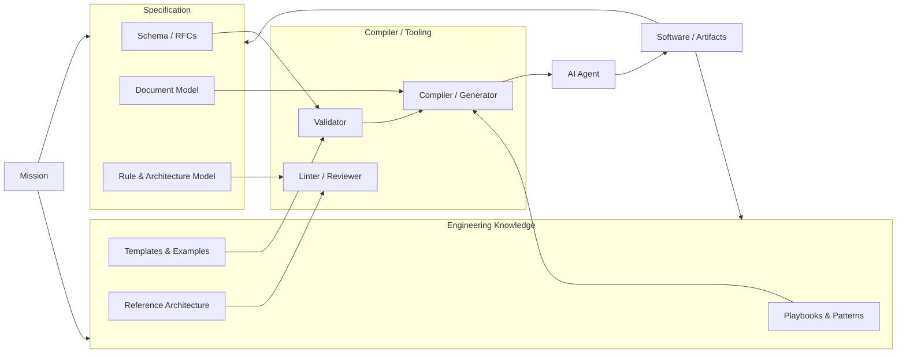

Document ID: NAEOS-GOV-003
Title: Mission
Version: 1.0.0
Status: Stable
Category: Governance
Owner: NAEOS OSS
Priority: Critical

Motto:
  Architecture Drives Engineering.

Depends On:
  - NAEOS-GOV-001 Project Charter
  - NAEOS-GOV-002 Vision

Referenced By:
  - NAEOS-GOV-004 Manifesto
  - NAEOS-GOV-005 Core Principles
  - NAEOS-SPEC-001 NAEOS Overview
NAEOS Mission
Executive Summary

Mission NAEOS is menerjemahkan visi become tindakan nyata through pembangunan a ekosistem engineering terbuka that menghubungkan manusia, pengetahuan, spesifikasi, AI agent, and software[...]

NAEOS berkomitmen build fondasi that memungkinkan:

engineer defines intent in jelas,
AI memahami konteks engineering,
sistem produce artefak berkualitas,
organisasi mempertahankan knowledge jangka panjang.
1. Purpose

This document defines misi resmi NAEOS.

Mission menjawab pertanyaan:

"Apa that must performed NAEOS to mencapai visi?"

2. Official Mission Statement
English

To design, develop, and maintain an open engineering specification ecosystem that enables humans and AI systems to collaboratively create secure, scalable, and maintainable software.

Indonesia

Merancang, build, and memelihara ekosistem spesifikasi engineering terbuka that memungkinkan manusia and sistem AI berkolaborasi menciptakan software that aman, scalable, and mudah maintained.

3. Mission Framework

NAEOS have lima misi utama.

Mission 01
Define Engineering Standards
Purpose

Build standar engineering that can used manusia and AI.

NAEOS MUST provide:
specification format,
document model,
rule model,
architecture model,
quality model.
Output
Engineering Knowledge

↓

Standardized Specification

↓

Reusable Engineering Practice
Mission 02
Preserve Engineering Knowledge
Purpose

Mengubah pengalaman engineering become aset that can used ulang.

Masalah currently:

Senior Engineer

↓

Knowledge

↓

Not terdokumentasi

↓

Hilang

Solusi NAEOS:

Experience

↓

Knowledge Model

↓

Specification

↓

Reusable Asset
Output
Playbooks
Patterns
Rules
Templates
Reference Architecture
Mission 03
Enable Human-AI Collaboration
Purpose

Menciptakan bahasa bersama antara manusia and AI.

Model tradisional:

Human

↓

Prompt

↓

AI

↓

Code

Model NAEOS:

Human

↓

Intent

↓

Specification

↓

AI Understanding

↓

Implementation
Output

AI can memahami:

objective,
constraint,
architecture,
security,
quality requirements.
Mission 04
Automate Engineering Governance
Purpose

Membuat kualitas software can divalidasi otomatis.

Contoh:

Developer membuat changes.

NAEOS memeriksa:

Architecture Rules

↓

Security Rules

↓

Testing Rules

↓

Documentation Rules

↓

Compliance
Output

Automation:

validator,
compiler,
linter,
generator,
reviewer.
Mission 05
Build Open Ecosystem
Purpose

Menciptakan komunitas and ekosistem global.

NAEOS support:

contributor,
researcher,
developer,
company,
educator.
4. Strategic Objectives
Objective 01

Build Core Specification.

Target:

NAEOS Specification v1.0
Objective 02

Build Compiler Infrastructure.

Target:

One Specification

↓

Multiple AI Platforms
Objective 03

Build Knowledge Registry.

Target:

Engineering Knowledge Marketplace
Objective 04

Build Reference Implementation.

Target:

Real Production System

Powered By NAEOS
5. Mission Architecture

6. Strategic Programs

NAEOS OSS akan have program following.

Program 01
NAEOS Specification Program

Fokus:

RFC
Schema
Standards
Documentation
Program 02
NAEOS Tooling Program

Fokus:

CLI
Compiler
Validator
SDK
Program 03
NAEOS Knowledge Program

Fokus:

Patterns
Playbooks
Examples
Research
Program 04
NAEOS Community Program

Fokus:

Contributor
Education
Certification
Events
7. Success Metrics

NAEOS Mission berhasil apabila:

Technical Metrics
specification tervalidasi otomatis,
compiler produce artefak,
AI agent can menggunakan specification.
Community Metrics
contributor aktif,
project menggunakan NAEOS,
profile domain available.
Quality Metrics
peningkatan konsistensi software,
pengurangan technical debt,
dokumentasi selalu sinkron.
8. Mission Principles

NAEOS follows prinsip:

Open By Default

Secure By Design

Specification First

Automation Friendly

Human Controlled

AI Assisted

Quality Driven
9. Constraints

NAEOS:

MUST:

remain vendor-neutral,
maintain open specification,
support interoperabilitas.

SHOULD:

menggunakan standar terbuka,
provide dokumentasi lengkap.

MAY:

provide layanan komersial.
10. Relationship With Motto
Specify Once

Mission ensure specification become aset utama.

Build Anywhere

Mission ensure specification can used across:

bahasa,
platform,
organisasi,
AI system.
11. Related Documents
ID	Document
NAEOS-GOV-001	Project Charter
NAEOS-GOV-002	Vision
NAEOS-GOV-004	Manifesto
NAEOS-GOV-005	Core Principles
NAEOS-SPEC-002	Engineering Knowledge Graph
Revision History
Version	Date	Change
1.0.0	2026	Initial Mission Definition
Status
NAEOS-GOV-003

APPROVED

Ready For Review
